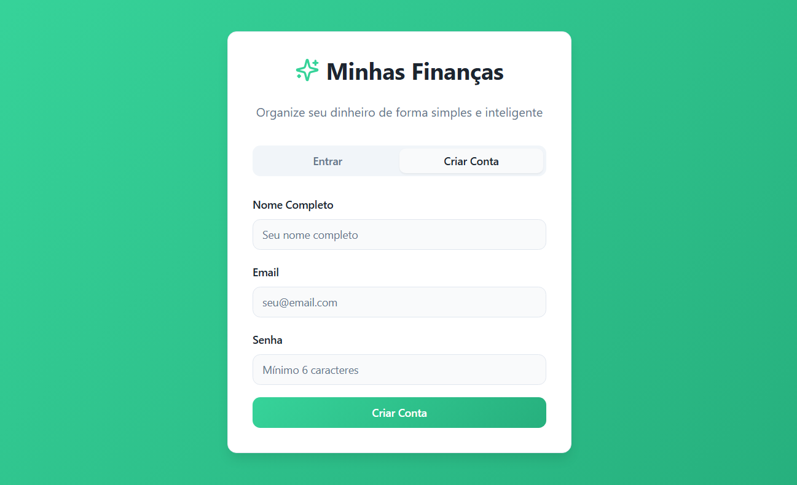

# smart-wallet-finance-rogerio

# 💸 App de Finanças Pessoais do Rogerio Sabino com Vibe Coding

Este projeto foi desenvolvido como um Desafio de Projeto da DIO de Vibe Coding utilizando o Lovable e o Copilot Web.  
A proposta é criar um aplicativo de organização financeira pessoal baseado em interações em linguagem natural.

## 📝 PRD Refinado no Copilot Web

### PRD – App de Organização Financeira com Conversa Natural

#### Visão Geral
Desenvolver um aplicativo de finanças pessoais baseado em conversas em linguagem natural.  
A proposta é tornar o controle financeiro mais intuitivo, acessível e livre de burocracias como planilhas e formulários complexos.

#### Problema a Resolver
Usuários iniciantes frequentemente abandonam apps de finanças por acharem o processo manual, técnico e pouco adaptável.  
Este projeto busca oferecer uma experiência conversacional fluida, com automação inteligente e personalização, facilitando o engajamento contínuo.

#### Público-Alvo
Pessoas que desejam começar a organizar suas finanças de forma prática e sem complicações, especialmente aquelas com pouca familiaridade com ferramentas financeiras tradicionais.

#### Funcionalidades Principais
- Registro de gastos via chat: O usuário informa seus gastos em linguagem natural, como “gastei R$ 30 no mercado”.
- Classificação automática de transações: O app interpreta e categoriza os gastos com base no texto.
- Metas financeiras personalizadas: O usuário define metas como “economizar R$ 500 até o fim do mês” e acompanha o progresso.
- Agente Financeiro Inteligente: Um assistente virtual que oferece dicas de economia com base nos hábitos do usuário.
- Relatórios visuais e personalizados: Visualizações simples e adaptadas ao estilo de cada usuário, com foco em clareza e relevância.

#### Design Universal – Acessibilidade para Todos
A solução será desenvolvida com base nos princípios de Design Universal, garantindo que o aplicativo ofereça uma experiência positiva, intuitiva e acessível para o maior número possível de usuários, independentemente de idade, nível de alfabetização digital, limitações físicas, cognitivas ou sensoriais.

Diretrizes práticas:
- Interface clara, legível e responsiva em diferentes tamanhos de tela
- Navegação simples, com foco em usabilidade e redução de esforço cognitivo
- Compatibilidade com leitores de tela, comandos por voz e teclados alternativos
- Feedbacks visuais e sonoros que reforçam ações e ajudam na compreensão
- Linguagem acessível, com tom educativo e acolhedor

#### Entregável da IA – MVP
A IA deve gerar um plano de MVP contendo:
- Estrutura das principais telas: chat, metas, relatórios
- Recursos técnicos essenciais: NLP (Processamento de Linguagem Natural), categorização automática, motor de recomendações
- Estratégia de validação com usuários reais (testes rápidos e feedbacks)
- Linguagem acessível e tom educativo, em português
- Aplicação dos princípios de Design Universal desde o protótipo inicial

## 💬 Interações com o Lovable

Crie um App de Finanças Pessoais com base no seguinte PRD (Product Requirements Document): {PRD}

Tentei criar uma meta chamada Reserva de Emergencia, mas ela não apareceu no componente. A impressão que tive foi que apenas o Assistente Financeiro a reconheceu, poderia verificar?  
Além disso, onde vejo os gráficos e extrato?

Sim (Quer que eu adicione uma tela de relatórios com gráficos e extrato detalhado das transações?)

## 🎯 Resultado Final

Acesse o protótipo funcional no Lovable:  
[lovable.app](https://lovable.dev/projects/20943472-0bd9-4c12-9a90-e180fc30ced8)

## 🔍 Funcionalidades do App de Organização Financeira

1. **Dashboard Financeiro**  
   Exibe um panorama claro das finanças pessoais:  
   - Receitas: Total de ganhos registrados  
   - Despesas: Total de gastos  
   - Saldo: Diferença entre receitas e despesas  
   Interface simples e direta para facilitar a compreensão

2. **Assistente Financeiro**  
   - Personagem conversacional que interage com o usuário  
   - Incentiva a conexão de contas e cartões para uma visão completa das finanças  
   - Oferece suporte emocional e motivacional

3. **Registro de Transações via Chat**  
   - Campo de entrada para o usuário digitar mensagens em linguagem natural  
   - Permite registrar gastos e interagir com o assistente de forma fluida

4. **Metas Financeiras**  
   - Área dedicada à criação e acompanhamento de objetivos financeiros  
   - Sugestão proativa para o usuário definir metas  
   - Botão de ação para adicionar novas metas

5. **Relatórios Personalizados**  
   - Visualizações simples e adaptadas ao estilo do usuário  
   - Acompanhamento de metas e progresso financeiro

6. **Design Universal**  
   Interface acessível e inclusiva:  
   - Linguagem simples  
   - Navegação clara  
   - Compatibilidade com leitores de tela e comandos por voz  
   - Feedbacks visuais e auditivos para facilitar o uso

## 🧠 Reflexão

**O que funcionou bem:**  
O refinamento do PRD previamente feito no Copilot ajudou muito, pois os créditos do Lovable acabaram em apenas 3 interações.

**O que não funcionou como o esperado:**  
Esperava poder interagir mais vezes gratuitamente com o Lovable, mas as interações feitas já foram de grande valia para aprender mais sobre Vibe Coding.

**O que aprendi sobre conversar com IAs:**  
Aprendi que é basicamente igual a conversar com uma pessoa: quanto mais detalhes e clareza você dá, melhor é a interação.
